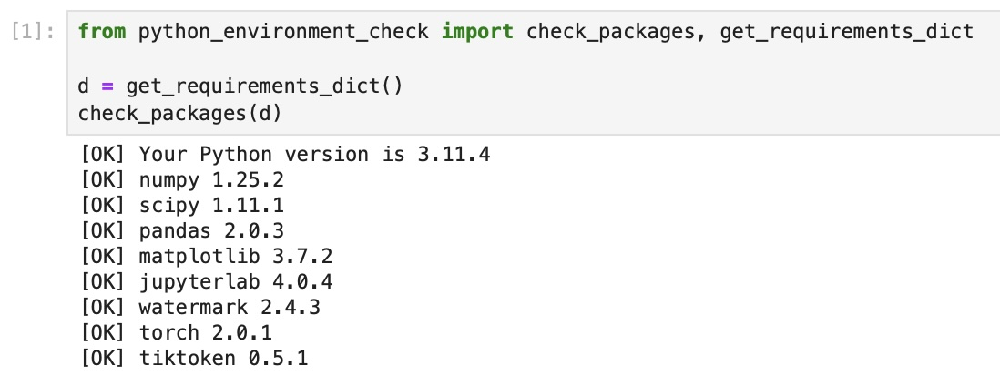
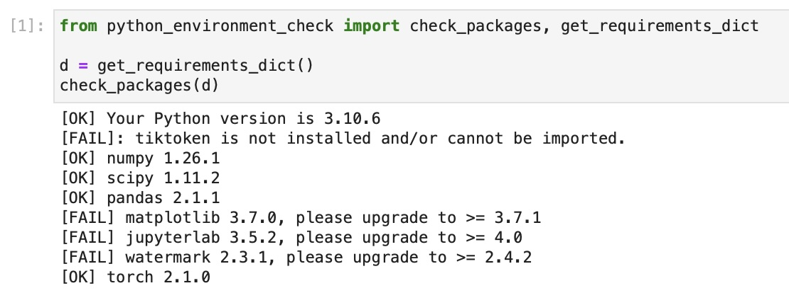

# Libraries Used In This Book

This document provides more information on double-checking your installed Python version and packages. (Please see the [../01_optional-python-setup-preferences](../01_optional-python-setup-preferences) folder for more information on installing Python and Python packages.)

I used the following main libraries in this book. Newer versions of these libraries are likely compatible as well. However, if you experience any problems with the code, you can try these library versions as a fallback:

-  numpy  1.24.3
-  scipy 1.10.1
-  pandas  2.0.2
-  matplotlib  3.7.1
-  jupyterlab  4.0
-  watermark  2.4.2
-  torch  2.0.1
-  tiktoken  0.5.1

To install these requirements most conveniently, you can use the `requirements.txt` file:

```
pip install -r requirements.txt
```


Then, after completing the installation, please check if all the packages are installed and are up to date using

```
python_environment_check.py
```


It's also recommended to check the versions in JupyterLab by running the `jupyter_environment_check.ipynb` in this directory, which should ideally give you the same results as above.



If you see the following issues, it's likely that your JupyterLab instance is connected to wrong conda environment:




In this case, you may want to use `watermark` to check if you opened the JupyterLab instance in the right conda environment using the `--conda` flag:


<br>
<br>


## Installing PyTorch

PyTorch can be installed just like any other Python library or package using pip. For example:

```bash
pip install torch==2.0.1
```

However, since PyTorch is a comprehensive library featuring CPU- and GPU-compatible codes, the installation may require additional settings and explanation (see the *A.1.3 Installing PyTorch in the book for more information*).

It's also highly recommended to consult the installation guide menu on the official PyTorch website at [https://pytorch.org](https://pytorch.org).


---


Any questions? Please feel free to reach out in the [Discussion Forum](https://github.com/rasbt/LLMs-from-scratch/discussions).
